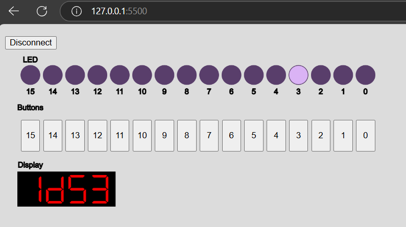

# violet
Virtual I/O for FPGAs

## What it does
This project enables FPGA designs to use virtual LED, hexadecimal display and button I/O through a web interface, over WebSerial and UART.

## How to use

### User interface
The UI can be launched by opening the [web/index.html](web/index.html) using a web browser which supports WebSerial (Chrome or Edge work). Pressing the "Connect" button in the top-left corner opens the port selector.

### Instantiating Violet in your Verilog design
This repository provides an [example](colorlight_example/top/top_violet_example.v) for the Colorlight 5A-75B V8.2 board, synthesized using Yosys and nextpnr.

To use Violet in your own project, you must include all of the files in the [violet](violet) folder into your design, and instantiate the Violet module as shown in the [example](colorlight_example/top/top_violet_example.v).

## Credits
The UI makes use of the [DSEG](https://github.com/keshikan/DSEG) font by [keshikan](https://github.com/keshikan), [p5.js](https://p5js.org) and [p5.webserial](https://github.com/gohai/p5.webserial) by [Gottfried Haider](https://github.com/gohai).
